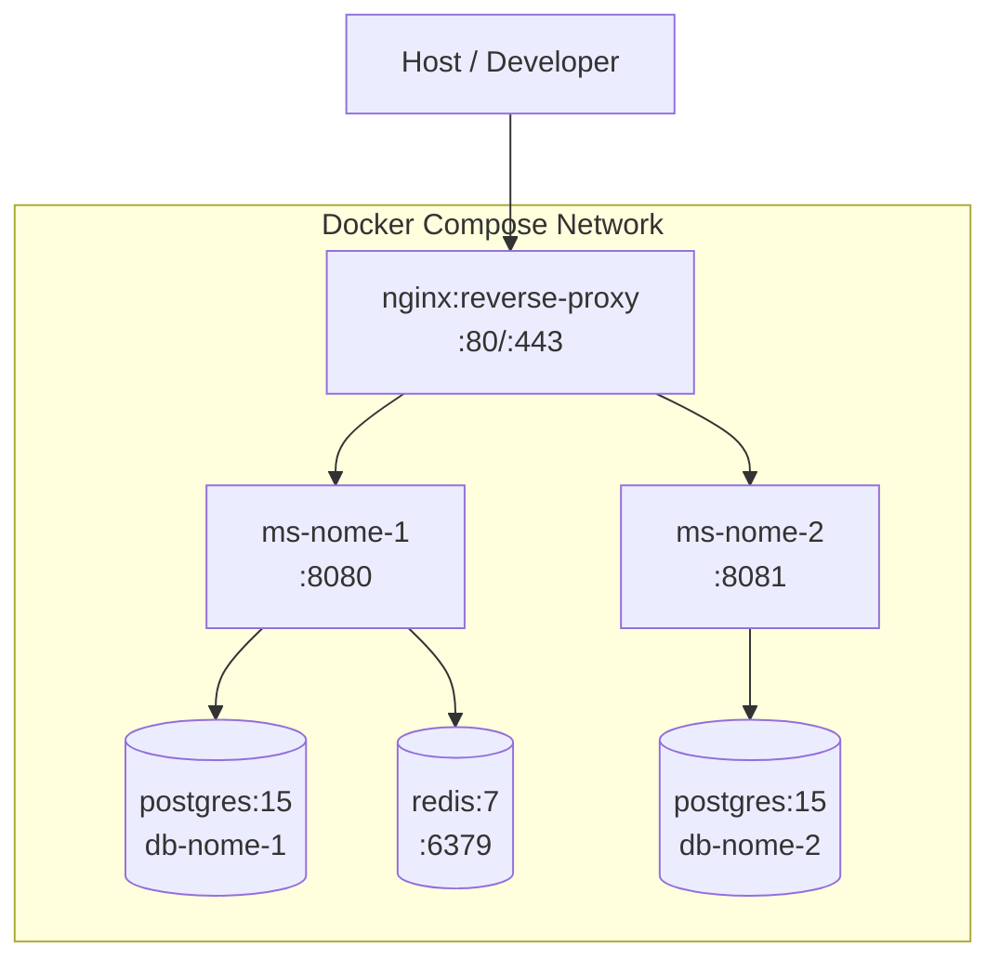

# Pattern Architetturali per Applicazioni PA

Reference per scegliere i pattern corretti al passo 3 del workflow arch-doc.

---

## 1. Pattern di Containerizzazione

### Docker Compose (sviluppo / piccoli deploy)

Usa quando: ambiente di sviluppo, PoC, sistemi con < 3 microservizi, nessun requisito di HA.

**Struttura Mermaid suggerita:**


**Note architetturali:**
- Nessun orchestratore: restart policy `unless-stopped`
- Volumi named per persistenza DB
- `.env` file per secrets (non commitare in git)
- Health check su tutti i servizi critici

---

### Kubernetes (produzione PA standard)

Usa quando: alta disponibilità richiesta, scaling orizzontale, >3 microservizi, cloud provider.

**Oggetti chiave da citare nel documento:**
- `Deployment` + `ReplicaSet` (min 2 repliche in prod)
- `Service` (ClusterIP interno, LoadBalancer/NodePort per esposizione)
- `Ingress` + `IngressController` (Nginx, Traefik)
- `ConfigMap` per configurazione applicativa
- `Secret` per credenziali (idealmente da Vault/ESO)
- `HorizontalPodAutoscaler` per scaling automatico
- `PersistentVolumeClaim` per storage stateful
- `NetworkPolicy` per isolamento namespace

**Namespace raccomandati:**
```
namespace/applicazione  → microservizi applicativi
namespace/infrastruttura → Kafka, Redis, MinIO
namespace/monitoring     → Prometheus, Grafana, Loki
namespace/ingress        → Ingress Controller
```

**Sizing minimo PA (prod):**
- Ogni microservizio: `requests: {cpu: 200m, memory: 256Mi}` / `limits: {cpu: 1000m, memory: 512Mi}`
- HPA: `minReplicas: 2, maxReplicas: 10, targetCPUUtilizationPercentage: 70`

---

### OpenShift (CONSIP / AgID compliant)

Usa quando: PA central, Polo Strategico Nazionale (PSN), contratti CONSIP, ambienti on-premise certificati.

**Differenze rispetto a Kubernetes puro:**
- `Route` invece di `Ingress` (HAProxy integrato)
- `BuildConfig` + `ImageStream` per CI/CD nativa
- `DeploymentConfig` (legacy) o `Deployment` + `ImageChange trigger`
- `SecurityContextConstraints` (SCC) più restrittivi — no root container
- Registry interna: `image-registry.openshift-image-registry.svc:5000`
- `Project` invece di `Namespace`

**Conformità AGID:**
- Immagini da registry certificata (Quay Enterprise / Nexus)
- No `latest` tag in produzione
- Resource quotas obbligatorie su ogni Project
- Logging centralizzato su OpenShift Logging (EFK stack)

---

## 2. Pattern di Comunicazione tra Microservizi

### REST sincrono (default per operazioni CRUD)

```
Client → API Gateway → ms-a → ms-b (se orchestrazione)
```

**Regole:**
- API Gateway gestisce autenticazione/autorizzazione (non delegare ai singoli ms)
- Timeout espliciti su ogni chiamata inter-service (es. 5s read timeout, 30s connect timeout)
- Circuit breaker (Resilience4j / Hystrix) per chiamate critiche
- Correlazione request con `X-Correlation-ID` header propagato

---

### Kafka asincrono (eventi, notifiche, audit)

Usa quando: disaccoppiamento producer/consumer, elaborazione in background, audit trail, notifiche.

**Naming convention topic:**
```
<ente>.<dominio>.<tipo-evento>
Esempi:
  mgs.pagamenti.confermato
  mgs.documenti.caricato
  mgs.utenti.registrato
```

**Schema messaggio standard:**
```json
{
  "eventId": "uuid",
  "eventType": "mgs.pagamenti.confermato",
  "timestamp": "ISO-8601",
  "correlationId": "uuid",
  "source": "ms-pagamenti-service",
  "payload": { ... }
}
```

**Configurazione Kafka consigliata per PA:**
- Partitions: 3 (bilancio throughput / ordering)
- Replication factor: 3 (HA)
- Retention: 7 giorni (default), 90 giorni per audit log
- Consumer group: `<ente>-<ms-consumer>-cg`
- Idempotent producer: `enable.idempotence=true`

---

## 3. Pattern di Storage

### PostgreSQL per microservizio (schema isolation)

**Principio:** ogni microservizio ha il proprio schema o database — mai condividere tabelle.

```
ms-utenti     → db-utenti     (schema: utenti)
ms-documenti  → db-documenti  (schema: documenti)
ms-pagamenti  → db-pagamenti  (schema: pagamenti)
```

Connection pool: HikariCP (Spring) o `asyncpg` (Python) con max 10 connessioni per pod.

---

### Redis (cache e sessioni)

| Use case | Configurazione |
|----------|---------------|
| Session cache | TTL 30min, eviction: `allkeys-lru` |
| Data cache (API) | TTL 5-15min, eviction: `volatile-lru` |
| Rate limiting | TTL 60s, `INCR`/`EXPIRE` atomico |
| Pub/Sub eventi | No TTL, pattern `<ente>:channel:*` |

**Key naming convention:** `<ente>:<ms>:<tipo>:<id>`
Esempio: `mgs:utenti:sessione:550e8400-e29b-41d4-a716-446655440000`

---

### Object Storage — MinIO / S3 (documenti PA)

Usa per: PDF, immagini, allegati, export, backup.

**Bucket naming:** `<ente>-<dominio>-<ambiente>`
Esempio: `mgs-documenti-prod`

**Path convention:** `<anno>/<mese>/<tipo-documento>/<uuid>.<ext>`
Esempio: `2026/04/contratto/550e8400.pdf`

**Integrazione MinIO:**
```python
import boto3
s3 = boto3.client('s3',
    endpoint_url='http://minio:9000',
    aws_access_key_id=os.getenv('MINIO_ACCESS_KEY'),
    aws_secret_access_key=os.getenv('MINIO_SECRET_KEY')
)
```

**Pre-signed URL per download sicuro:** URL temporanei (es. 1h) invece di esporre oggetti pubblici.

---

## 4. Servizi Esterni PA

### SPID / CIE (Autenticazione Nazionale)

**Protocollo:** SAML 2.0 (SPID) / OIDC (CIE / eID europeo)

**Flusso SPID SP-Initiated:**
1. Utente clicca "Entra con SPID"
2. SP genera `AuthnRequest` firmata → redirect a IdP scelto
3. IdP autentica utente → invia `SAMLResponse` (Base64 firmata) al SP
4. SP valida firma e asserzione → crea sessione locale

**Attributi SPID obbligatori (SpidL2):** `fiscalNumber`, `name`, `familyName`, `email`

**Librerie consigliate:**
- Java: `onelogin/java-saml`
- Python: `python3-saml`
- Node.js: `passport-saml`

**Sequence diagram:** usa template #4 con IdP = `SPID IdP (es. Aruba / Poste)`

---

### PagoPA

**Protocollo:** REST (API PagoPA Nodo dei Pagamenti)

**Flusso semplificato:**
1. ms-pagamenti crea `Posizione Debitoria` → POST `/organizations/{orgId}/debtpositions`
2. Frontend redirige utente su checkout PagoPA
3. PagoPA notifica esito → POST sul `notificationUrl` (webhook)
4. ms-pagamenti aggiorna stato pagamento + pubblica evento Kafka

**Ambienti:** `api.uat.platform.pagopa.it` (test), `api.platform.pagopa.it` (prod)

---

### ANPR (Anagrafe Nazionale Popolazione Residente)

**Protocollo:** REST con autenticazione certificato client mTLS

**Endpoint chiave:**
- `GET /anpr/api/v1/soggetti/{codiceFiscale}` — ricerca soggetto
- Autenticazione: certificato digitale del Comune/Ente emesso da AgID

---

### PDND / ModI (Interoperabilità PA)

**Descrizione:** Piattaforma Digitale Nazionale Dati — gateway per API PA.

**Flusso autenticazione:**
1. Fruitore ottiene voucher JWT da PDND (autenticazione con chiave privata)
2. Fruitore chiama API Erogatore includendo voucher nell'header `Authorization: Bearer <voucher>`
3. Erogatore valida voucher con PDND

**Standard:** ModI (Modello di Interoperabilità) con profilo `PDND_SIGN_1` per integrità.

---

## 5. Naming Conventions PA

| Elemento | Convention | Esempio |
|---------|-----------|---------|
| Microservizio | `<ente>-<dominio>-service` | `mgs-utenti-service` |
| Topic Kafka | `<ente>.<dominio>.<evento>` | `mgs.pagamenti.confermato` |
| API path | `/api/v1/<risorsa>/{id}` | `/api/v1/documenti/550e84` |
| DB schema | `<dominio>` | `utenti`, `documenti` |
| Redis key | `<ente>:<ms>:<tipo>:<id>` | `mgs:utenti:sessione:uuid` |
| Bucket S3 | `<ente>-<dominio>-<env>` | `mgs-documenti-prod` |
| Namespace K8s | `<ente>-<layer>` | `mgs-applicazione` |
| Docker image | `registry/<ente>/<ms>:<semver>` | `registry/mgs/ms-utenti:1.2.3` |

---

## 6. Topologie Applicative Comuni per PA

### Gestionale (2-4 microservizi)

```
API Gateway → ms-core → DB (PostgreSQL)
             ms-report → DB (read replica o DW)
             ms-auth  → DB + Redis
```

### Portale Cittadino (5-8 microservizi + IdP)

```
API Gateway → ms-auth (SPID/CIE) → Redis
             ms-fascicolo → DB + S3
             ms-servizi → DB
             ms-pagamenti → PagoPA
             ms-notifiche → Kafka → ms-email
```

### Piattaforma Documentale (ms + Object Storage + OCR)

```
API Gateway → ms-upload → S3 + Kafka
             ms-ocr ← Kafka → DB (testo estratto)
             ms-search → Elasticsearch
             ms-export → S3 (output)
```
