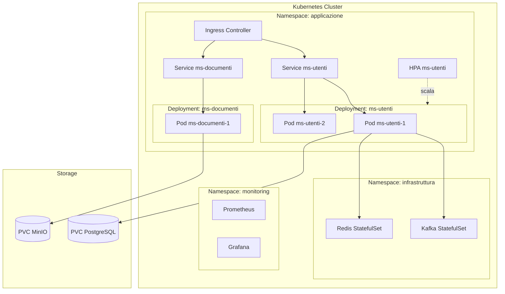
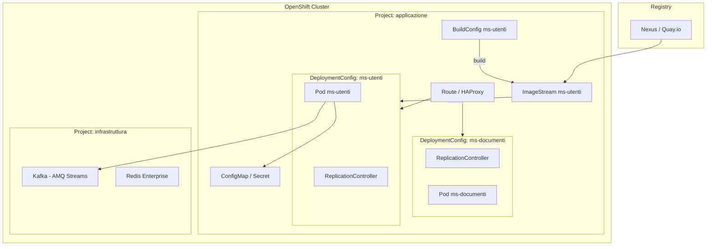
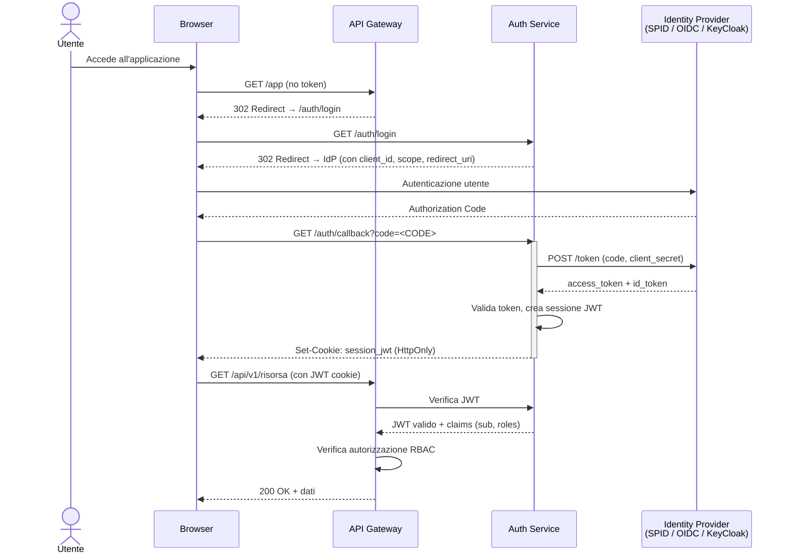
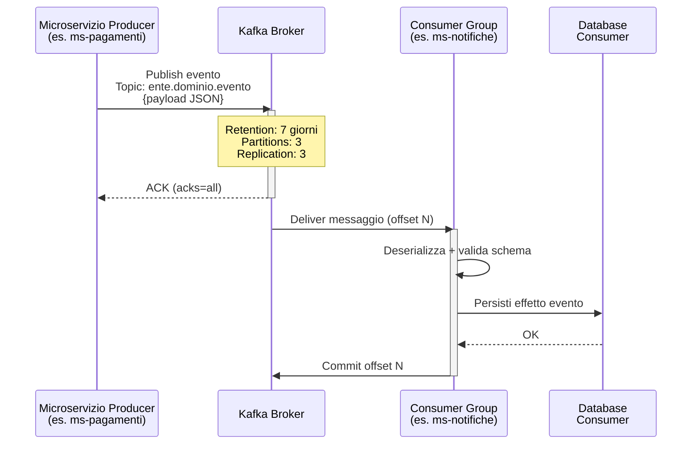
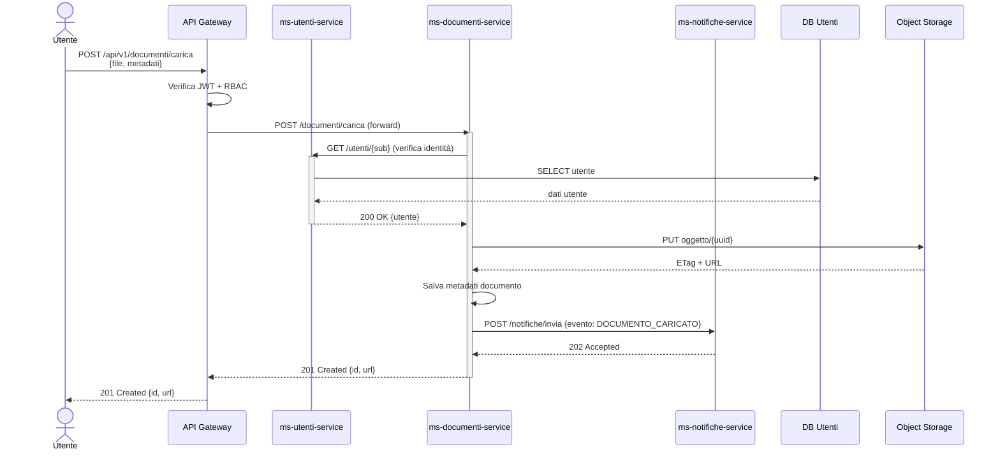
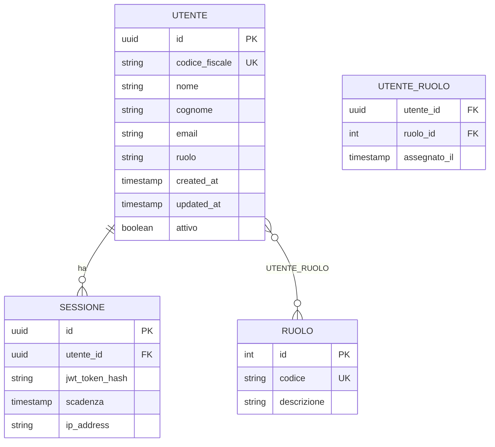
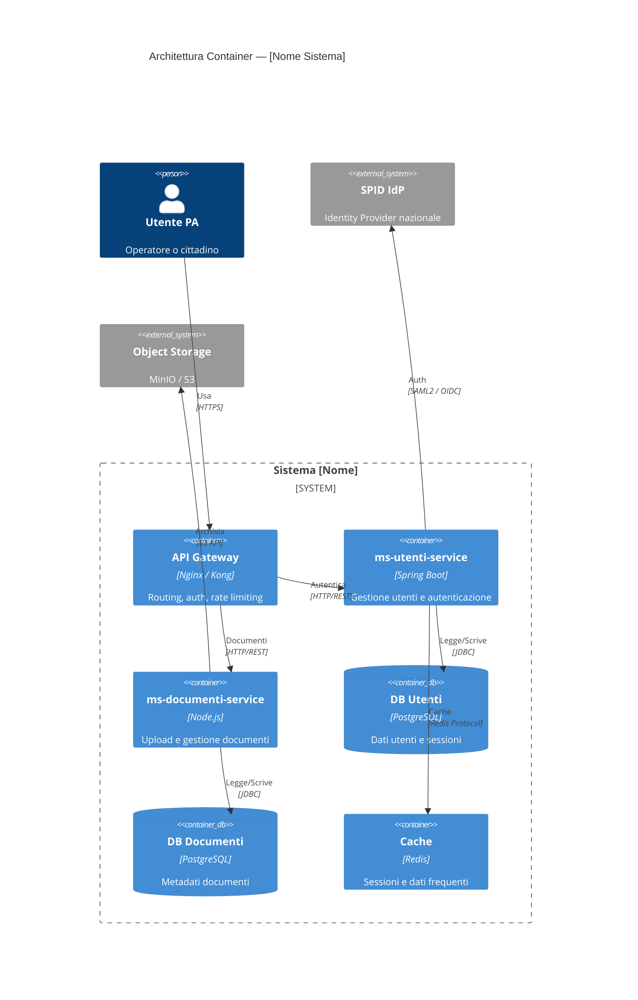

# Mermaid Templates per Architettura PA

Template pronti all'uso. Adatta sostituendo i nomi dei servizi con quelli reali estratti dai documenti.
Le righe con `# →` indicano cosa personalizzare.

---

## 1. Architecture Overview — `graph TB`

Usa sempre come primo diagramma della sezione "Panoramica Architetturale".
Adatta il numero di microservizi e aggiungi/rimuovi blocchi infrastrutturali.

```mermaid
graph TB
    subgraph Client["Client Layer"]
        BROWSER[Browser / App Mobile]
    end

    subgraph Ingress["API Gateway / Ingress"]
        GW[API Gateway]          %% → sostituisci con nome reale (es. Kong, Nginx, Spring Gateway)
    end

    subgraph Microservizi["Microservizi"]
        MS1[ms-utenti-service]   %% → nome microservizio 1
        MS2[ms-documenti-service] %% → nome microservizio 2
        MS3[ms-notifiche-service] %% → nome microservizio 3 (rimuovi se non presente)
    end

    subgraph Infrastruttura["Infrastruttura"]
        KAFKA[Kafka Broker]      %% → rimuovi se non presente
        REDIS[(Redis Cache)]     %% → rimuovi se non presente
        S3[(Object Storage\nMinIO / S3)] %% → rimuovi se non presente
    end

    subgraph Persistenza["Persistenza"]
        DB1[(PostgreSQL\ndb-utenti)]       %% → adatta per ms 1
        DB2[(PostgreSQL\ndb-documenti)]    %% → adatta per ms 2
    end

    subgraph Esterni["Servizi Esterni PA"]
        SPID[SPID / CIE IdP]    %% → rimuovi se non presente
        PAGOPA[PagoPA]          %% → rimuovi se non presente
    end

    BROWSER --> GW
    GW --> MS1
    GW --> MS2
    GW --> MS3
    MS1 --> DB1
    MS2 --> DB2
    MS2 --> S3
    MS3 --> KAFKA
    MS1 --> REDIS
    MS1 --> SPID
    MS2 --> PAGOPA
```

---

## 2. Kubernetes Deployment Topology — `graph TB`

Usa quando la containerizzazione è Kubernetes (produzione PA standard).



---

## 3. OpenShift Deployment Topology — `graph TB`

Usa quando la containerizzazione è OpenShift (CONSIP/AgID compliant).



---

## 4. Auth Flow OIDC / SPID — `sequenceDiagram`

Usa per la sezione "Modello di Autenticazione". Adatta per OAuth2/OIDC standard o SPID.



---

## 5. Kafka Event Flow — `sequenceDiagram`

Usa nella sezione "Panoramica Architetturale / Comunicazione Asincrona" se Kafka è presente.



---

## 6. REST Request Chain (3 microservizi) — `sequenceDiagram`

Usa per processi complessi che coinvolgono più microservizi in sequenza.



---

## 7. ER Diagram per Microservizio — `erDiagram`

Usa una istanza per ogni microservizio nella sezione "Modello Dati".
Includi solo le entità del microservizio corrente (non le entità di altri ms).



---

## 8. C4Container — Alternativa a graph TB (sperimentale)

Usa come alternativa alla `graph TB` se si vuole una vista C4. Nota: sintassi sperimentale in Mermaid.



---

## 9. CI/CD Pipeline — `graph LR` (opzionale)

Includi nella sezione Introduzione o come appendice se richiesto.

```mermaid
graph LR
    GIT[Git Repository\nGitLab / GitHub] -->|push| CI

    subgraph CI["CI Pipeline"]
        BUILD[Build & Test]
        SAST[SAST / SCA\nSonarQube]
        IMG[Build Docker Image]
        SCAN[Image Scan\nTrivy / Clair]
    end

    CI -->|image push| REG[Container Registry\nNexus / Quay]
    REG -->|deploy| CD

    subgraph CD["CD Pipeline"]
        DEV[Deploy DEV]
        INT[Deploy INT/Test]
        PROD[Deploy PROD\n(manuale / approvazione)]
    end

    DEV --> INT --> PROD
```
